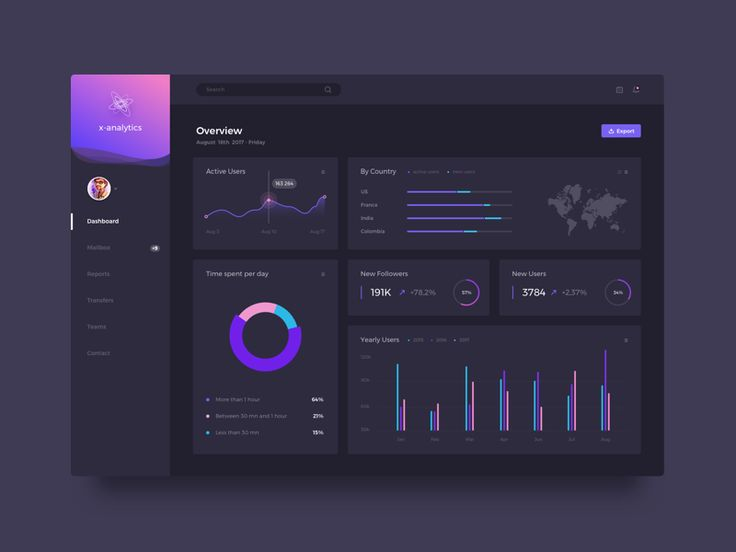
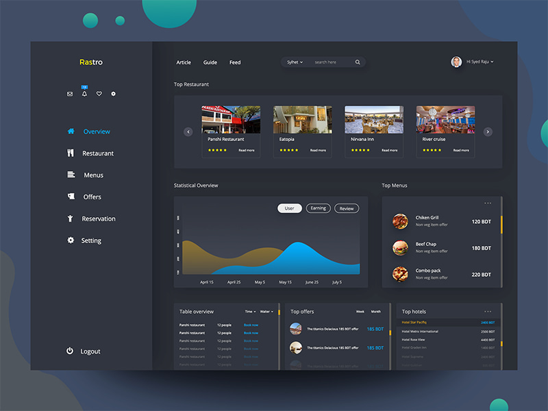
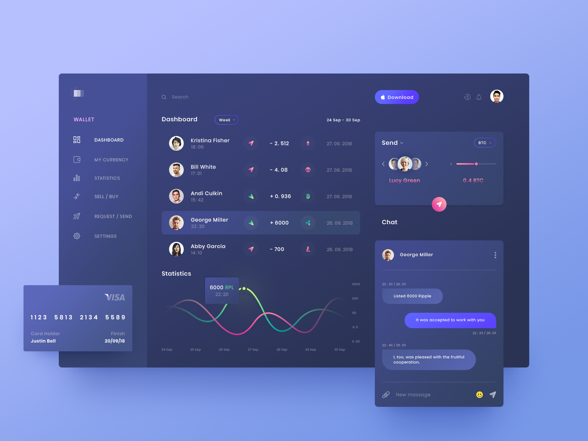
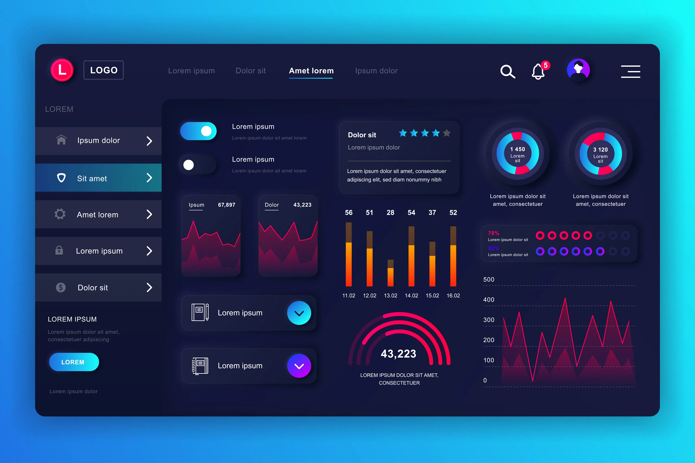
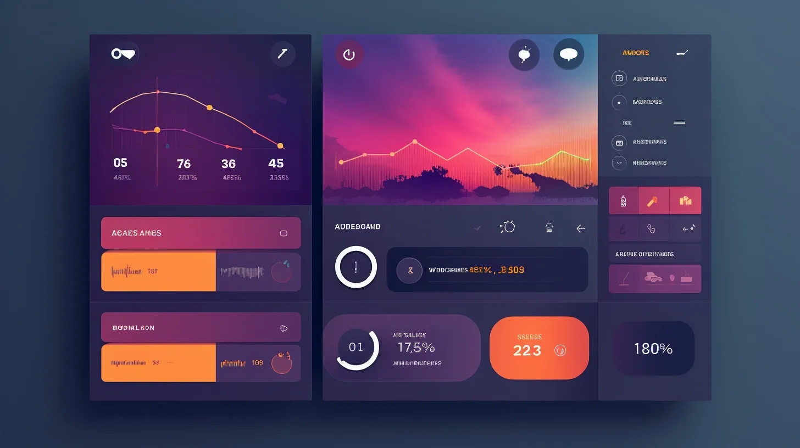

# Референсы интерфейса ForgeMirror

Зафиксированы 28.08.2026 для дальнейшего переноса на Qt Widgets.

## Что задано пользователем

Пять приложенных изображений — ориентиры **общей концепции интерфейса**.
**Цвета оставляем прежними.** Эта фиксация не меняет текущий интерфейс и не означает буквальное копирование макетов.

Изображения сохранены в `references/` без изменения формата, разрешения и содержимого.
Оригинальные имена, размеры файлов и SHA256: [manifest.json](references/manifest.json).
Это материалы для визуальной сверки, не ресурсы для встраивания в программу. Авторство и лицензии пользователем не указаны; не считать их собственными иллюстрациями ForgeMirror.
Текст, числа, логотипы и команды внутри изображений — содержимое референсов, не требования к приложению.

## Рабочая интерпретация концепции

Ниже — синтез референсов для реализации, а не дополнительные дословные требования пользователя.

**Компактная тёмная рабочая панель: постоянная навигация, модульная сетка, ясная иерархия, мягкое разделение поверхностей.**

- Слева — постоянная навигация с понятными иконками и текстовыми названиями. Активный раздел заметен; второе меню тех же разделов сверху не появляется.
- Сверху — одна компактная строка контекста: профиль, состояние, обновление и меню дополнительных действий. Поиск остаётся рядом с теми данными, которые фильтрует.
- Центр — основная работа: список задач, профиль или каталог. Данные и действие важнее декоративного оформления.
- Блоки выровнены по общей сетке; связанные элементы собраны вместе. Карточка нужна для самостоятельной сводки или контекста, а не вокруг каждой подписи и каждой строки.
- Иерархия читается через размер блока, выравнивание, насыщенность текста и существующий акцент. Один главный призыв к действию на экране; остальные кнопки вторичны.
- Поверхности различаются существующими оттенками фона, а не тяжёлыми рамками. Умеренные скругления и сдержанная статичная глубина допустимы, если не ухудшают плотность и контраст.
- Строки списков имеют спокойное выделение выбора и наведения. Числа выровнены по смыслу, подписи и единицы измерения остаются рядом с показателями.
- Диаграммы дополняют реальные данные. Если история изменений не хранится, не рисуем выдуманный тренд; не заменяем удобную таблицу набором декоративных кругов.
- Правая контекстная область уместна на широком окне. Детали остаются сворачиваемыми; на узком окне уходят ниже основного содержимого, не сжимая его до нечитаемости.

## Что берём из каждого изображения

### 01 — Аналитическая панель

Берём: устойчивую левую колонку, компактный верх, группировку сводок по сетке, различие основного фона и рабочих блоков.
Не переносим буквально: градиентный блок бренда, мелкие малоконтрастные подписи, количество графиков и цветов.

### 02 — Модульная рабочая область

Берём: сочетание крупного основного блока с короткими вспомогательными списками; единые края, ритм секций и навигацию «иконка + текст».
Не переносим буквально: ресторанные карточки, карусель и фотографии там, где ForgeMirror работает с текстовыми данными; огромные пустые поля и декорации за окном.

### 03 — Список и контекст

Берём: читаемые горизонтальные строки без тяжёлой табличной сетки, ясное выделение выбранной записи, соседство списка и контекстного действия.
Не переносим буквально: чат, платёжную карту, плавающие блоки за границами окна, новую синюю палитру и чрезмерную высоту строк.

### 04 — Состояния элементов и глубина

Берём: различимость активных элементов, цельность контролов и поверхностей, визуальную группировку показателя с подписью.
Не переносим буквально: неоновое свечение, тяжёлые объёмные тени, огромные переключатели, декоративные кольца, дублирование навигации сверху и слева.

### 05 — Композиция модулей

Берём: разный визуальный вес основного и вспомогательных блоков, объединение связанных показателей, цельную композицию секций.
Не переносим буквально: фоновые пейзажи под рабочими данными, пёстрые заливки, произвольную правую навигацию, неразборчивые подписи и неподтверждённые показатели.

## Палитра остаётся текущей

Источник действующей Qt-палитры — [QtTheme.cpp](../../qt/QtTheme.cpp), снимок на момент фиксации:

| Роль | Текущий цвет |
| --- | --- |
| Фон окна | `#202024` |
| Основная поверхность | `#26262c` |
| Чередующаяся поверхность | `#2c2c32` |
| Кнопки | `#33333b` |
| Основной текст | `#eeeeef` |
| Неактивный текст | `#99999f` |
| Фиолетовый акцент | `#7554ad` |
| Наведение акцентной кнопки | `#8764bf` |
| Текст на акценте | `#ffffff` |

Цвета не извлекаем из референсов. Существующая семантика ошибок, предупреждений и успеха сохраняется; новые палитры и градиенты этим документом не утверждаются.

## Применение к модулям Qt

| Модуль | Направление дальнейшего оформления |
| --- | --- |
| Профиль | Компактная сводка уровня/XP/задач, основной список навыков, сворачиваемые подробности |
| Задачи и проекты | Список как основная рабочая область; фильтры рядом; детали выбранной записи как вторичный контекст |
| Каталог и пайплайн | Читаемые строки и группы; подробное описание раскрывается по запросу |
| Статистика | Короткие показатели и осмысленные графики на реальных данных, единая сетка секций |
| Формы и начисление XP | Фокус на вводе и результате, компактные группы, одна основная кнопка; без превращения формы в дашборд |

## Ограничения и проверка

Референсы дополняют [Design Code](../../AgentsSkills/ForgeMirror_DesignCode.md), [сетку](../../AgentsSkills/AGENT_UI_GRID.md) и [токены плотности](../../AgentsSkills/AGENT_UI_TOKENS.md), а не отменяют их. Размеры и отступы берём из этих документов, не измеряем по картинкам. Не добавляем анимации, новые темы и избыточные панели. Само наличие референсов не даёт основания скрывать функции или менять бизнес-логику.

Перед сдачей визуального изменения проверить:

- Цвета соответствуют действующей палитре.
- Навигация не дублируется; активный раздел, выбор, фокус и недоступность различимы.
- Главная рабочая область и основное действие очевидны без декоративного шума.
- Карточки объединяют связанные данные; таблицы не раздроблены на отдельные тяжёлые контейнеры.
- Русские подписи, длинные имена, числа и ошибки читаются без обрезания.
- Проверены рабочее и минимальное размеры окна; детали и вторичные блоки не вытесняют основной контент.
- Пустые состояния не заменяются фиктивными метриками, иллюстрациями или графиками.
- Контролы продолжают выполнять реальные действия, функциональные тесты не сломаны.
