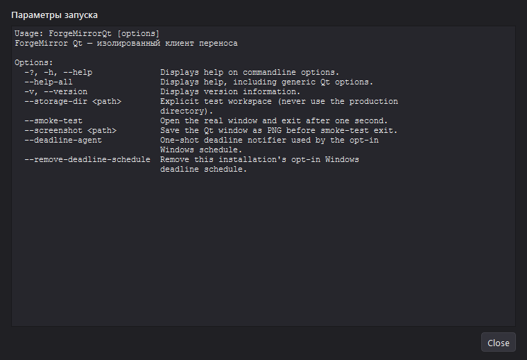

# Справка командной строки в Qt UI — 2026-09-30

## Наблюдение и изменение

GUI-запуск ForgeMirrorQt.exe с параметром --help без консольного stdout показывал системный текст справки в узком окне: Usage содержал полный абсолютный путь к exe, а длинные строки дробились на короткие обрывки. Для режима без доступного вывода добавлен отдельный диалог шириной до 760 px и высотой до 520 px, адаптируемый к доступной области экрана. Текст отображается моноширинно и без автоматического переноса строк с горизонтальной/вертикальной прокруткой; в строке Usage путь установленного файла сокращается до ForgeMirrorQt [options].

CLI-поведение сохранено: если stdout доступен (терминал, перенаправление или тестовый pipe), --help и --version продолжают штатно писать результат и завершаются без показа модального окна. В обычном GUI-запуске краткий --version остаётся компактным информационным диалогом. Режим --help --smoke-test --screenshot <path> захватывает диалог и автоматически закрывает его для проверки.

## Результат

| Проверка | Результат |
| --- | --- |
| TestQtCommandHelpDialogLayout — заголовок, доступные имена, моноширинный текст, отключённый перенос, видимая область и размеры | пройдено |
| TestQtCommandHelpProcess — запуск дочернего Qt exe, автоматическое закрытие, PNG и нормальное завершение | пройдено |
| Стандартный smoke_qt | 1/1 passed |
| smoke_core | OK |
| Временный package smoke с Qt удалённым из PATH, переменными Qt и проверкой platforms/qwindows.dll | exit 0; скриншот 17,852 байт |

Временный проверочный пакет находился в build-qt/ui-review-final-cc1caa07a5894e559d936d4cb1ee1175; это не установленный релиз и не проверка installer lifecycle. Основные тестовые функции находятся в tests/smoke_qt.cpp.
