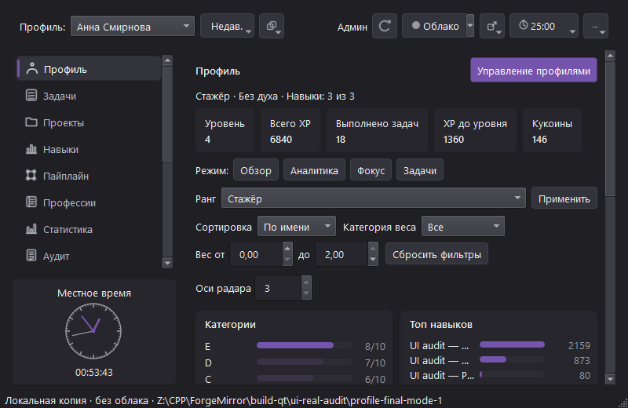
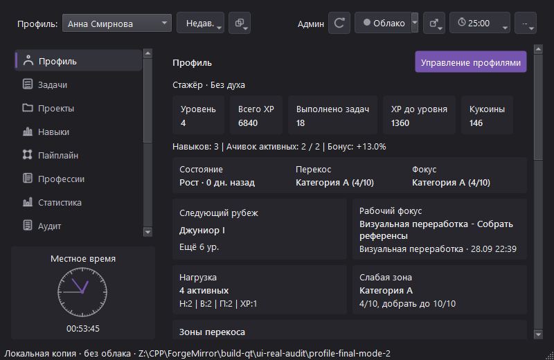
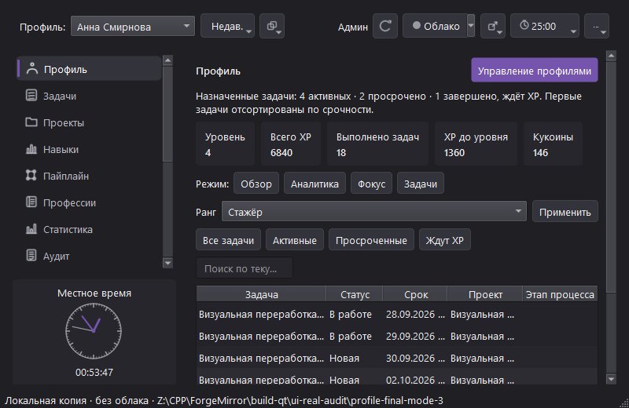

# Режимы профиля и компактная шапка — 29.09.2026

## Результат

Проверены реальные окна приложения 0.6.88 при размере клиента 800×520. В отдельном временном пакете и отдельных тестовых workspace сняты «Аналитика», «Фокус» и «Задачи». У этих режимов теперь разные рабочие области: аналитические фильтры с категориями и рейтингом навыков; обзор фокуса и нагрузки; фильтры назначенных задач и компактная таблица. В режимах «Аналитика» и «Задачи» большой обзор не повторяется перед содержимым. Общая строка KPI, выбор профиля и переключатели режима остаются на месте.

Шапка сохранена однострочной. При масштабе 100% на снимках нет горизонтальной полосы: быстрые действия используют компактные контурные кнопки с сохранёнными подсказками и accessibility names; Pomodoro показывает иконку и оставшееся время. Если увеличение шрифта делает строку шире доступного места, `Qt::ScrollBarAsNeeded` сохраняет доступ к действиям прокруткой вместо их обрезания. Цветовая палитра не менялась.

| Режим | Снимок |
| --- | --- |
| Аналитика |  |
| Фокус |  |
| Задачи |  |

## Проверки

- `TestQtRecentProfileActions` переключает профиль в режимы Analytics/Focus/Tasks при 800×520, проверяет ожидаемые области, отсутствие горизонтального переполнения содержимого и адаптивность фильтров.
- Полный `ctest --test-dir build-qt -C Release --output-on-failure -R "^smoke_qt$"` прошёл: 1/1.
- Временный пакет запускался без среды разработки в `PATH` и без унаследованных Qt plugin переменных. Все три окна завершились с кодом 0; снимки созданы; `platforms/qwindows.dll` присутствует.
- `build-test/Release/smoke_core.exe` вывел `smoke_core: OK`; `git diff --check` прошёл без ошибок пробелов (только предупреждения нормализации переводов строк).

## Остаток

Это локальный проход по трём режимам профиля и шапке, а не закрытие этапа профиля или всего редизайна. Ещё нужны заполненный Overview после иерархических правок, статистика и длинный/пустой контент, клавиатурный фокус, disabled-состояния и несколько уровней масштабирования. Новые motion-переходы пока не добавлялись: статические экраны ещё не стабилизированы.
