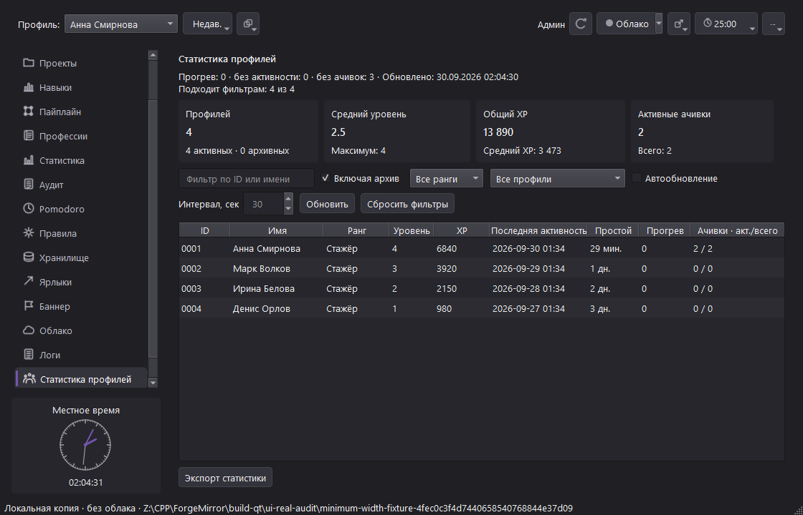

# KPI статистики профилей — 2026-09-30

## Изменение

Многострочная сводка сверху экрана статистики конкурировала с таблицей и придавала одинаковый вес главным числам и диагностике. Вынесены четыре реальные метрики в компактный ряд: количество профилей с числом активных/архивных, средний уровень с максимумом, общий XP со средним значением, активные ачивки с полным числом.

Для карточек используются существующие Qt-токены QFrame metric=true и QLabel metricValue=true; палитра и форма рамок не менялись. Ряд переносится на доступную ширину. Диагностические сигналы и время обновления остаются коротким текстом, а расширенная сводка доступна в tooltip и через доступные имена карточек.

## Реальный снимок

Снимок снят у временного Qt-пакета на заполненном синтетическом workspace при 1120×720. Пакет использовался с PATH только системных каталогов Windows и без Qt plugin-переменных; platforms/qwindows.dll лежал рядом. Рабочая папка находилась под build-qt, production-профили и установленная версия не открывались и не изменялись.

## Проверки и ограничения

- Полный smoke_qt прошёл 1/1; тест статистики проверяет 4 карточки, их реальные значения, сводку, архивную строку и фильтрацию.
- Полная матрица всех 18 разделов при 800×520 прошла без внешнего горизонтального переполнения.
- smoke_core: OK.
- Временный пакет: build-qt/ui-review-kpi-568a51b1563c4e468d70da3541f49746; эта сборка не является опубликованным установщиком и не прошла installer lifecycle.
- Остаток: снимки других представлений статистики, пустое/длинное состояние, клавиатурный фокус и масштабы 90–200%.
